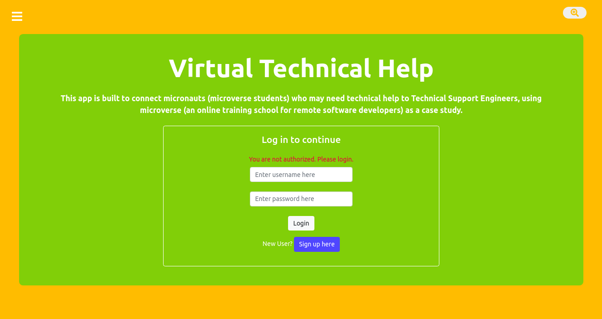
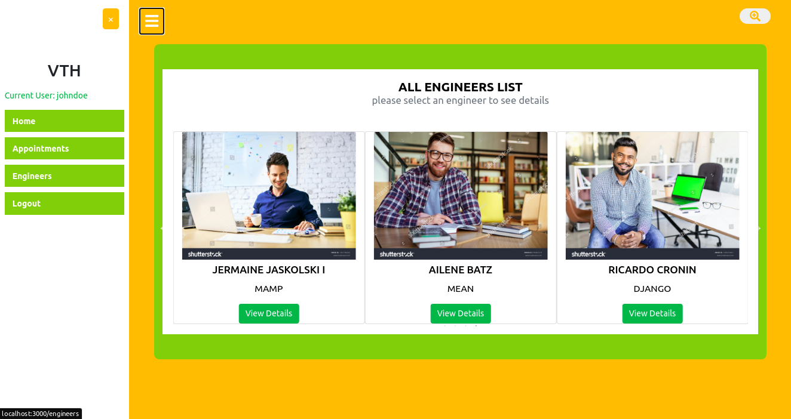

# Virtual-Technical-Help (Client-Side)

> This is the client side of a technical support application. This app is built to connect micronauts (microverse students) who may need technical help to Technical Support Engineers, using microverse (an online training school for remote software developers) as a case study.It fetches from [this](https://github.com/teekaytech/Virtual-Technical-Help-App-Backend) backend API (server-side), and it is built with React/Redux.

## Built With

- CSS
- npm
- ES6
- React/Redux
- React Router DOM
- React-Create-App
- 

## Live Demo

<a href="https://vth-client-side.netlify.app/" target="_blank">Technical Support App</a>

## Getting Started

To get a local copy up and running follow these simple example steps.

- On the project GitHub page, navigate to the main page of the repository [this page](https://github.com/teekaytech/Virtual-Technical-Help-App-Frontend.git).
- Under the repository name, locate and click on a green button named `Code`.
- Copy the project URL as displayed.
- If you're running Windows Operating System, open your command prompt. On Linux, Open your terminal.
- Change the current working directory to the location where you want the cloned directory to be made. Leave as it is if the current location is where you want the project to be.
- Type `git clone`, and then paste the URL you copied in Step 3. 
  `$ git clone https://github.com/teekaytech/Virtual-Technical-Help-App-Frontend.git` <em>Press Enter key</em> 
- Press Enter. Your local copy will be created.

Please Note that you must have github installed on your PC, this can be done

### Prerequisites

- [Git](https://gist.github.com/derhuerst/1b15ff4652a867391f03).
- Web browser (Chrome/Firefox)
- [Node](https://nodejs.org/en/)
- [NPM](https://www.npmjs.com/get-npm)

### Usage

Click on the live demo link and peruse the app.

### Making Changes

- `npm install` to install the dependencies and packages
- `npm start` to test the app after changes were made

## Author

👤 **Taofeek Olalere**

- Github: [@teekaytech](https://github.com/teekaytech)
- Twitter: [@ola_lere](https://twitter.com/ola_lere)
- Linkedin: [olaleretaofeek](https://linkedin.com/in/olaleretaofeek)
- Portfolio: [Olalere Taofeek](https://teekaytech.github.io/olaleretaofeek/)

## 🤝 Contributing

Contributions, issues and feature requests are welcome!

Feel free to check the [issues page](https://github.com/teekaytech/React-Calclator/issues/).

## Show your support

Give a ⭐️ if you like this project!

## Acknowledgments

- [Microverse](https://.microverse.org/)
- [create-react-app boilerplate from Facebook team](https://github.com/facebook/create-react-app)
- [Image Color Picker tool](https://imagecolorpicker.com/)
- [Design idea by Murat Korkmaz on Behance](https://www.behance.net/muratk)
- [Netlify](https://app.netlify.com/)
- [Reinald Reynoso's articles medium](https://medium.com/better-programming/build-a-react-redux-app-with-javascript-web-tokens-9f2b73768e18)

## 📝 License

This project is [MIT](/LICENSE) licensed.
